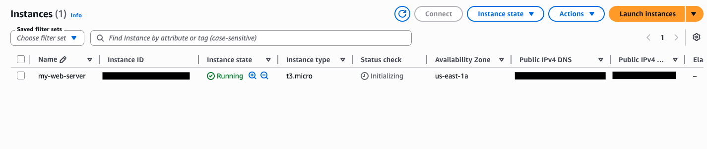
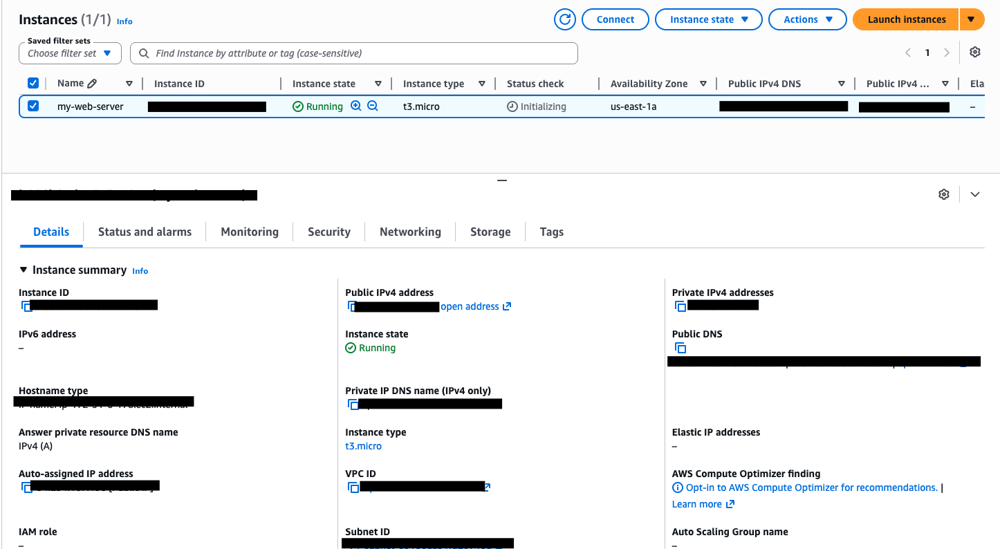
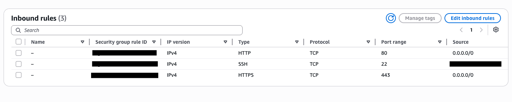
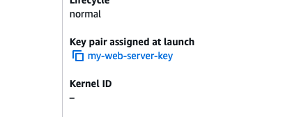

# EC2 Web Server Deployment

**Services:** Amazon EC2 · Security Groups · VPC · Key Pairs  
**Goal:** Deploy a hardened EC2 instance configured for web server workloads with properly scoped network access controls.

---

## What I Built

Launched an Amazon EC2 instance (Amazon Linux 2) configured as a web server, with deliberate attention to security group rules, network placement, and instance hardening — not just getting it running, but locking it down correctly.

---

## Architecture

```
Internet
    |
[Security Group]
  - Port 80 (HTTP)  → 0.0.0.0/0
  - Port 443 (HTTPS) → 0.0.0.0/0
  - Port 22 (SSH)   → My IP only
    |
[EC2 Instance - Amazon Linux 2]
  - t2.micro
  - Public Subnet
  - Key pair authentication
```

---

## Key Configuration Decisions

**Security Group scoping**
SSH access (port 22) was restricted to a specific IP rather than open to the world (0.0.0.0/0). This is a common misconfiguration in real environments — leaving SSH open is one of the top causes of unauthorized access on cloud instances.

**Key pair over password authentication**
Used EC2 key pair (RSA) instead of password-based login. Passwords are brute-forceable; key pairs are not.

**Instance type selection**
Selected t2.micro intentionally — for a non-production web server, right-sizing matters. Over-provisioning compute costs money; under-provisioning causes performance issues. Matching instance type to workload is a real operational skill.

---

## Troubleshooting Encountered

**Issue:** Could not reach the instance on port 80 after launch.  
**Root cause:** Security group only had SSH (22) open — forgot to add the HTTP inbound rule.  
**Fix:** Added inbound rule for TCP port 80 from 0.0.0.0/0. Instance became reachable immediately.  
**Lesson:** Security groups are stateful but require explicit inbound rules per port. Default behavior is deny-all.

---

## What I'd Do Differently in Production

- Place the instance in a **private subnet** behind an Application Load Balancer — no direct internet exposure to the compute layer
- Use **Systems Manager Session Manager** for SSH access instead of opening port 22 at all
- Attach an **IAM instance profile** with least-privilege permissions rather than embedding credentials
- Enable **CloudWatch agent** for log forwarding and metric collection

## Screenshots








