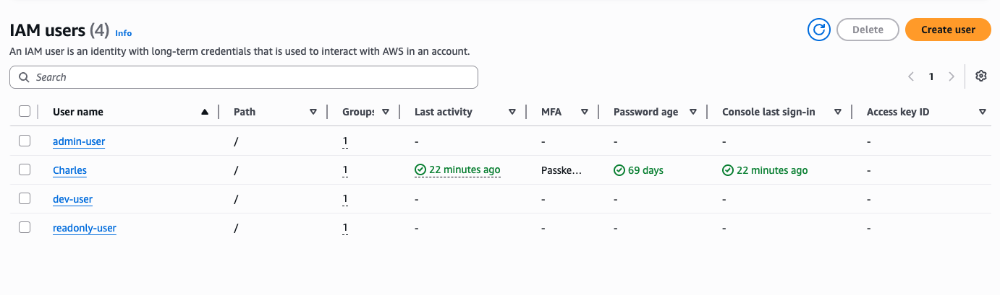
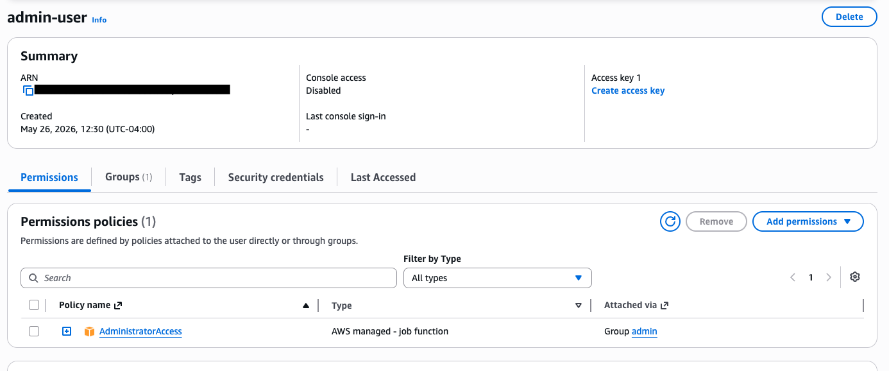
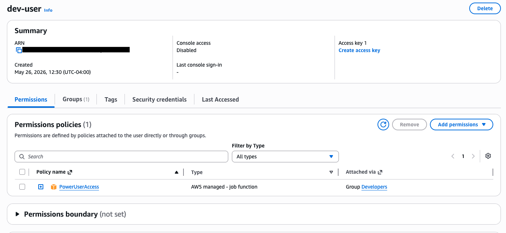
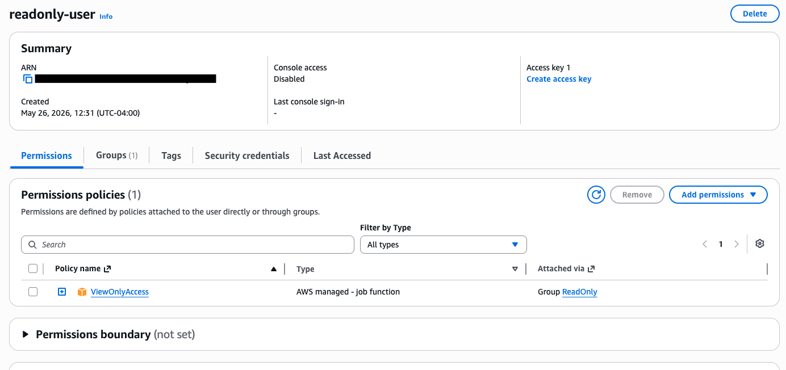
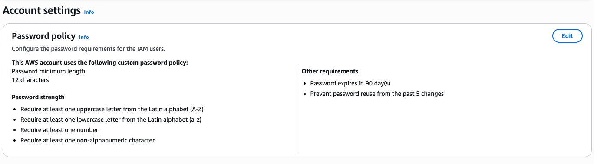

# IAM Least-Privilege Access Architecture

**Services:** AWS IAM · Users · Groups · Policies · Password Policy  
**Goal:** Design and implement a multi-user IAM structure that enforces least-privilege access and separates permissions by role — mirroring how access control is managed in a real AWS environment.

---

## What I Built

Configured an IAM structure with distinct user groups, scoped permission policies, and enforced account-level security settings. The goal wasn't just creating users — it was building a permission model that would hold up under a security audit.

---

## Architecture

```
AWS Account
├── Group: Admins
│   └── Policy: AdministratorAccess
│   └── Users: [admin-user]
│
├── Group: Developers
│   └── Policy: PowerUserAccess (no IAM)
│   └── Users: [dev-user]
│
├── Group: ReadOnly
│   └── Policy: ReadOnlyAccess
│   └── Users: [readonly-user]
│
└── Account Password Policy
    ├── Min length: 12 characters
    ├── Require uppercase, lowercase, numbers, symbols
    ├── Password expiration: 90 days
    └── Prevent password reuse: last 5
```

---

## Key Configuration Decisions

**Group-based permissions over user-level policies**
Assigning policies directly to individual users creates an unmanageable mess at scale. Group-based permissions mean you manage the role, not every individual — when someone joins or leaves, you add or remove them from the group.

**No permissions for the root account**
Root account credentials were not used after initial setup. In production, root should have MFA enabled and be locked away — it should never be used for day-to-day operations.

**Separation of Admin vs Developer access**
Developers received PowerUserAccess (can do most things) but explicitly cannot modify IAM. This prevents privilege escalation — a developer shouldn't be able to grant themselves admin rights.

**Explicit deny vs. implicit deny**
AWS denies everything by default (implicit deny). I tested the difference between relying on implicit deny and adding an explicit Deny statement in a policy — explicit denies override any Allow, which matters when policies stack.

---

## Troubleshooting Encountered

**Issue:** ReadOnly user was able to launch EC2 instances.  
**Root cause:** Applied `AmazonEC2ReadOnlyAccess` but also attached an older policy with broader EC2 permissions.  
**Fix:** Removed the conflicting policy. Verified permissions using the IAM Policy Simulator.  
**Lesson:** Always use the IAM Policy Simulator to test effective permissions — stacked policies produce non-obvious results.

---

## What I'd Do Differently in Production

- Require **MFA for all users**, especially those with admin or write access
- Use **IAM Roles** instead of IAM users for any application or service needing AWS access
- Implement **AWS Organizations SCPs** (Service Control Policies) to set hard permission boundaries across accounts
- Enable **CloudTrail** to log all API calls for audit and incident response
- Rotate access keys on a schedule and alert on unused credentials

## Screenshots










