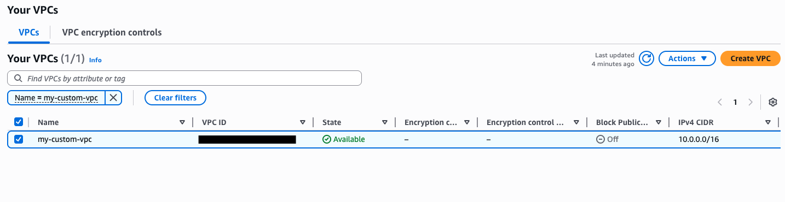
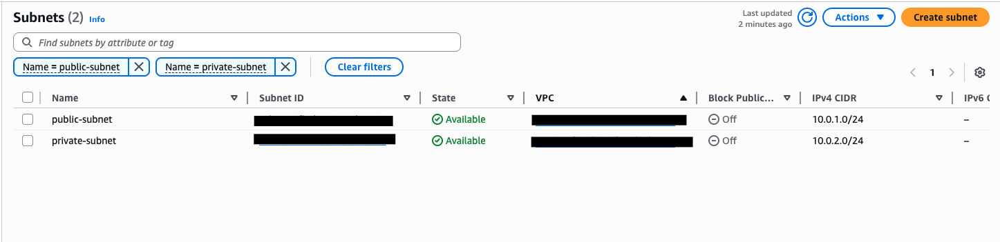
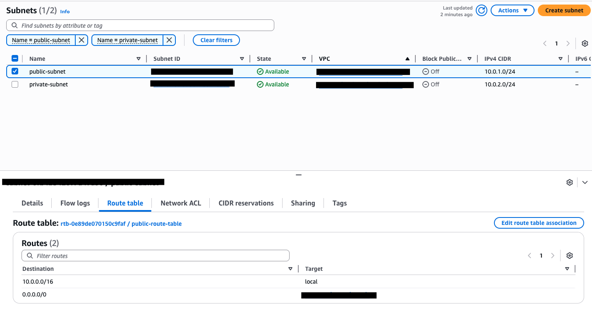
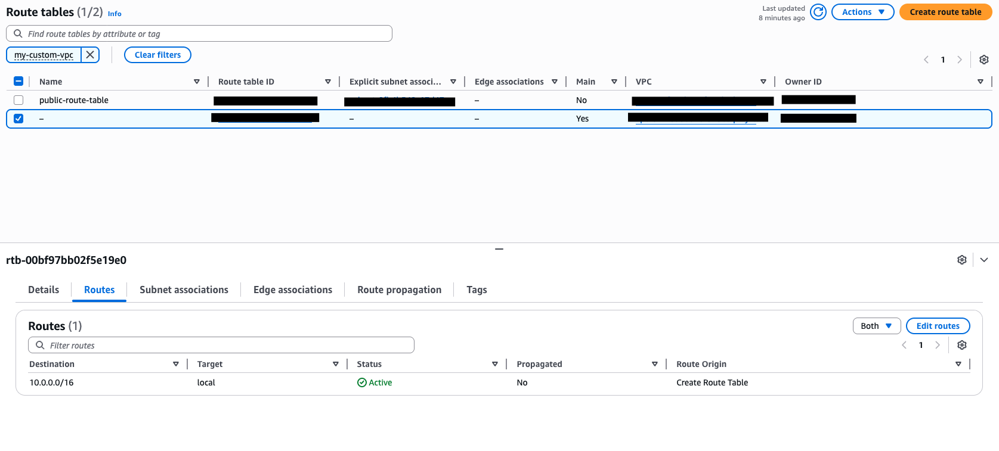

# Custom VPC Network Architecture

**Services:** Amazon VPC · Subnets · Route Tables · Internet Gateway · Security Groups  
**Goal:** Design and configure a custom VPC with isolated public and private subnets, proper routing, and controlled internet access — the foundational network layer for any AWS deployment.

---

## What I Built

Built a custom VPC from scratch rather than using the AWS default VPC. The default VPC gets every new AWS account running quickly, but it's not how production infrastructure is built. This project covers the full network stack: address space planning, subnet segmentation, routing logic, and internet gateway attachment.

---

## Architecture

```
VPC: 10.0.0.0/16
├── Public Subnet: 10.0.1.0/24  (AZ: us-east-1a)
│   ├── Route Table
│   │   ├── 10.0.0.0/16 → local
│   │   └── 0.0.0.0/0  → Internet Gateway
│   └── Resources: EC2 (web tier)
│
├── Private Subnet: 10.0.2.0/24  (AZ: us-east-1a)
│   ├── Route Table
│   │   └── 10.0.0.0/16 → local (no internet route)
│   └── Resources: DB tier (no direct internet access)
│
└── Internet Gateway
    └── Attached to VPC
    └── Referenced in public subnet route table only
```

---

## Key Configuration Decisions

**Custom CIDR over default**
Chose 10.0.0.0/16 deliberately to provide 65,536 IP addresses with room to grow. The /24 subnets provide 251 usable IPs each (AWS reserves 5 per subnet). Planning address space prevents painful re-architecture later.

**Public vs. private subnet separation**
The public subnet has a route to the internet gateway (0.0.0.0/0 → IGW). The private subnet does not. This is the fundamental segmentation pattern — internet-facing resources (load balancers, NAT gateways) in the public subnet; databases and application servers in the private subnet.

**Separate route tables per subnet**
Created dedicated route tables rather than sharing the main route table. This is best practice — changes to one subnet's routing don't accidentally affect another.

**Security groups as instance-level firewall**
Layered security groups on top of subnet-level network ACLs. Security groups are stateful (return traffic automatically allowed); NACLs are stateless (require explicit inbound and outbound rules).

---

## Troubleshooting Encountered

**Issue:** EC2 instance in the public subnet had no internet connectivity despite being in the correct subnet.  
**Root cause:** The route table associated with the public subnet did not have a route to the internet gateway — only the local route existed.  
**Fix:** Added a route: destination `0.0.0.0/0`, target = the Internet Gateway ID. Connectivity restored.  
**Lesson:** Subnet placement alone doesn't determine internet access. The route table attached to that subnet must have an explicit IGW route. "Public" subnet is just a naming convention — the routing makes it real.

---

## What I'd Do Differently in Production

- Add a **NAT Gateway** in the public subnet so private subnet resources can initiate outbound internet connections (for patches, updates) without being directly reachable from the internet
- Spread subnets across **multiple Availability Zones** for high availability
- Implement **Network ACLs** as a secondary stateless defense layer at the subnet boundary
- Enable **VPC Flow Logs** to capture all network traffic for monitoring and incident investigation
- Use **VPC Endpoints** for services like S3 and DynamoDB to keep that traffic inside the AWS network

  ## Screenshots








